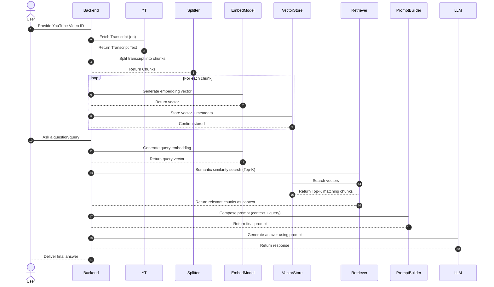

# YouTube Transcript RAG Architecture

## Overview
This repository implements a Retrieval-Augmented Generation (RAG) pipeline that ingests YouTube video transcripts, splits them into semantic chunks, generates embeddings, stores them in an in-memory vector index (Chroma or FAISS), retrieves the most relevant context for a user query, and generates context-grounded responses using an LLM.

The system is designed for extensibility and optimized for handling large transcripts efficiently.

---
## Architecture & Data Flow

```
YouTube Video ID
   → Transcript API (YT Transcript API)
      → Document Loader
         → Text Splitter (Chunking)
            → Embedding Model (Vectorization)
               → Vector Store / Index (Chroma or FAISS)
                  → Retriever (Query Embedding + Semantic Search)
                     → Top-K Relevant Chunks (Context)
                        → Prompt Builder (Context + Query)
                           → LLM
                              → Final Natural Language Response
```
---
## Sequence Flow


## Components

### 1. **YouTube Transcript API**
- Fetches transcripts using the provided video ID.
- Supports language filtering (default: English).

### 2. **Text Splitter**
- Breaks large transcript text into smaller, semantically coherent chunks.
- Improves embedding relevance and retrieval accuracy.

### 3. **Embedding Model**
- Converts text chunks into high-dimensional vector representations.
- Must match the retriever query embedding model for consistent similarity search.

### 4. **Vector Store / Index**
- **Chroma**: Stores embeddings in an in-memory vector DB collection.
- **FAISS**: Indexes embeddings in an efficient in-memory similarity search structure.

### 5. **Retriever**
- Converts user queries into embedding vectors.
- Performs semantic similarity search to fetch the most relevant transcript chunks as context.

### 6. **Prompt Builder**
- Merges retrieved context chunks and the user query into a structured prompt.
- Helps reduce hallucination by explicitly grounding responses in retrieved data.

### 7. **LLM**
- Generates responses based on prompt input enriched with semantic context.
- Supports OpenAI, Azure OpenAI, Gemini, or other OpenAI-compatible endpoints.

---

## Features
- **Handles large transcripts** via chunking and vector indexing.
- **In-memory support** for vector stores.
- **Extensible design** for additional loaders, embedding models, and LLM providers.
- **Parallelizable pipeline** for ingestion and embedding generation.
- **Semantic search** for context-grounded response generation.

---

## Example Vector Store Initialization

### Chroma (In-Memory)
```python
vectorstore = Chroma.from_documents(
    documents=documents,
    embedding=embedding_model,
    collection_name="my_collection"
)
```

### FAISS (In-Memory Index)
```python
vector_store = FAISS.from_documents(
    documents=chunks,
    embedding=embedding_model
)
```

---

## Use Cases
- Question answering on YouTube video content.
- NLP learning and prototyping.
- Generative AI applications requiring transcript grounding.
- Embedding and semantic search experimentation.

---
